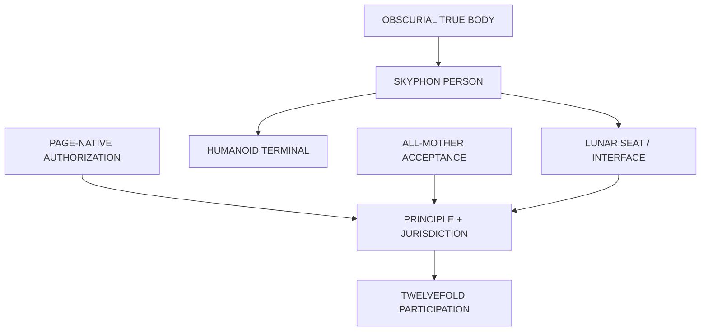

> *"The Intact Seal was built. The Obscurials were not."*
> — restricted structural maxim

## What the Name Describes

An **Obscurial** is one of twelve physically real, profoundly nonhuman true bodies whose origin cannot be reduced to the native grammar of a Page, Chapter, or Book. The protected term for that condition is **grammar-exterior**.

The name describes what kind of being it is and what its true body is. **Skyphon** describes who that same being became through sustained life with Terra. Sciel is an Obscurial and Sciel is a Skyphon: those statements describe body and person, not two beings joined together.

The distinction still matters. The twelve did not enter Vael'Khar as demonstrably finished personalities with the names later preserved by the [[the-church|Church]]. Personhood developed through duration, memory, interpretation, disagreement, affection, responsibility, and repeated contact with Terra's peoples.

## What Is Known About Their Arrival

The twelve Obscurial true bodies physically entered the Vael'Khar system. Their entry is an ordered event that [[time|Time]] can place before Precursor detection, Seat construction, the mature Twelvefold era, and the Fracture.

Time cannot follow any of them backward beyond that entry. It cannot establish where they existed before arrival, what created them, whether creation is the right concept, or what causal history preceded local contact. The surviving mystery is therefore precise: **Terra knows when they entered the system, but not where they came from.**

The record does not establish whether all twelve entries were simultaneous.

## What the Precursors Built

The [[precursors|Precursors]] encountered the true bodies. They did not manufacture them. They built the enormous lunar **Seats** that made a bounded relationship possible.

| Seat function | What it accomplished |
|---|---|
| **Localization** | Gave one Obscurial a stable Page-local address |
| **Translation** | Made a limited relation intelligible inside Terra's grammar |
| **Constraint** | Prevented unrestricted foreign expression |
| **Jurisdiction** | Allowed one Principle to operate lawfully within a bounded field |
| **Co-address** | Joined body, Terra, interface, All-Mother, and terminal |
| **Twelvefold participation** | Let all twelve relations limit one another |

The Precursors also built humanoid **terminals**. A terminal was the same Skyphon's Terra-facing body: a social form with voice, face, hands, senses, clothing, and a presentation the person could gradually make their own. It was not a second mind, a clone, an artificial intelligence, or the true body.

## How a Skyphon Relation Worked

The Page Primordial supplied local grammatical authorization. The Precursors supplied the Seat and interface. The All-Mother supplied living planetary acceptance. The Obscurial supplied the foreign true body and the developing person.

These terms made lawful relationship possible. They did not assemble the person from separate parts.

## Principle, Directive, and Jurisdiction

A **Principle** was the bounded Terra-local relation through which one Obscurial became intelligible. It was not the being's complete native ontology.

A **Directive** became constitutive of the developed Skyphon's identity: the enduring imperative through which the person interpreted responsibility.

A **Jurisdiction** was the field in which the complete Seat–Terra relation made that Directive lawfully executable. A Skyphon could retain memory and Directive after losing the Seat without retaining authority over Terra.

The twelve Principles formed four mutually limiting phrases:

| Phrase | Principles |
|---|---|
| **Expression** | Determinacy, Cohesion, Accord |
| **Habitation** | Interval, Legibility, Recurrence |
| **Return** | Conversion, Closure, Release |
| **Becoming** | Selfhood, Consequence, Attainment |

## What the Fracture Destroyed

The Fracture destroyed the twelve Terra-local relationships, not the twelve people.

Seats ruptured, disconnected, sheared, or lost phase. Terminals and other local expressions suffered twelve distinct catastrophic endings. The All-Mother lost living co-address. Jurisdictions ceased. The true bodies became **unseated**: physically released while also losing the architecture that made their location and contact locally well-behaved.

All twelve Skyphons survived initial unseating. Their trail crossed a wider celestial crisis involving Heaven, Hell, the Pathway, Seraphic authority, and the Abyssal inverse. Three Seraphim disappeared beyond the accessible Firmament in connection with that trajectory. Seven remain contactable as the **Seven Answers**. Beyond the crisis, the Skyphons' present address, condition, and grouping are unknown.

## What Modern Instruments Contain

The [[lunar-crown|Lunar Crown]], White Desert, Ardeatan relic field, Nearc, Clepsydra, and other custodial sites preserve real Seat components, interfaces, relays, terminal traces, regulation systems, and resonance scars. Institutions may sincerely call these remains **Instruments**.

They do not contain sleeping Skyphons or actual Obscurial bodies. Rebuilding a terminal would not call its person back. Any genuine attempt to reconnect or re-seat a Skyphon would require a complete lawful relation that no modern institution can safely reproduce—and a damaged address path on which something else might answer.

## Boundaries That Matter

The Obscurials are not the Quiet Moon, Primordials, gods, angels, Seraphim, demons, or fragments of the Sovereign. Heaven and Hell are not their homelands.

The Sovereign's Seraphic forms can resemble Obscurial morphology because divine expression became locally coherent in a world already shaped by the Twelvefold. This is structural refraction, not ancestry. Demons remain fragments of the Sovereign's Abyssal inverse; a limited number of genuine fallen angels exist, but demonkind did not descend from them.

## In One Sentence

The Obscurials are the twelve foreign true bodies that became the Skyphon persons through life with Terra, survived the destruction of their local Seats, and now remain beyond accessible address.
