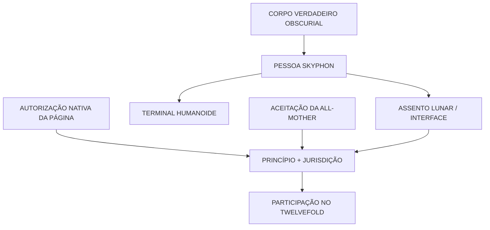

> *"O Selo Intacto foi construído. Os Obscurials não foram."*
> — máxima estrutural restrita

## O Que o Nome Descreve

Um **Obscurial** é um entre doze corpos verdadeiros fisicamente reais e profundamente não humanos cuja origem não pode ser reduzida à gramática nativa de uma Página, Capítulo ou Livro. O termo protegido para essa condição é **exterior à gramática**.

O nome descreve que tipo de ser ele é e qual é seu corpo verdadeiro. **Skyphon** descreve quem esse mesmo ser se tornou através de uma vida prolongada com Terra. Sciel é um Obscurial e Sciel é uma Skyphon: as duas afirmações descrevem corpo e pessoa, não dois seres unidos.

A distinção continua importante. Os doze não entraram em Vael'Khar como personalidades comprovadamente prontas com os nomes depois preservados pela [[the-church|Igreja]]. A personalidade desenvolveu-se através de duração, memória, interpretação, discordância, afeto, responsabilidade e contato repetido com os povos de Terra.

## O Que se Sabe Sobre a Chegada

Os doze corpos verdadeiros Obscurials entraram fisicamente no sistema Vael'Khar. A entrada é um evento ordenado que o [[time|Tempo]] pode situar antes da detecção dos Precursores, da construção dos Assentos, da era madura do Twelvefold e da Fratura.

O Tempo não consegue seguir nenhum deles para trás além dessa entrada. Não pode determinar onde existiam antes, o que os criou, se criação é o conceito adequado ou qual história causal precedeu o contato local. O mistério é preciso: **Terra sabe quando entraram no sistema, mas não de onde vieram.**

O registro não estabelece se as doze entradas foram simultâneas.

## O Que os Precursores Construíram

Os [[precursors|Precursores]] encontraram os corpos verdadeiros. Não os fabricaram. Construíram os enormes **Assentos** lunares que tornaram possível uma relação limitada.

| Função do Assento | O que realizava |
|---|---|
| **Localização** | Dava a um Obscurial um endereço local estável na Página |
| **Tradução** | Tornava uma relação limitada inteligível na gramática de Terra |
| **Contenção** | Impedia expressão estrangeira irrestrita |
| **Jurisdição** | Permitia que um Princípio operasse legitimamente em um campo limitado |
| **Coendereço** | Ligava corpo, Terra, interface, All-Mother e terminal |
| **Participação no Twelvefold** | Permitia que as doze relações limitassem umas às outras |

Os Precursores também construíram **terminais** humanoides. Um terminal era o corpo voltado para Terra do mesmo Skyphon: uma forma social com voz, rosto, mãos, sentidos, roupas e uma apresentação que a pessoa podia gradualmente tornar sua. Não era uma segunda mente, clone, inteligência artificial ou corpo verdadeiro.

## Como Funcionava uma Relação Skyphon

O Primordial da Página fornecia autorização gramatical local. Os Precursores forneciam o Assento e a interface. A All-Mother fornecia aceitação planetária viva. O Obscurial fornecia o corpo verdadeiro estrangeiro e a pessoa em desenvolvimento.

Esses termos tornavam a relação legítima possível. Não montavam a pessoa a partir de partes separadas.

## Princípio, Diretiva e Jurisdição

Um **Princípio** era a relação limitada de Terra através da qual um Obscurial se tornava inteligível. Não era a ontologia nativa completa do ser.

Uma **Diretiva** tornou-se constitutiva da identidade do Skyphon desenvolvido: o imperativo duradouro através do qual a pessoa interpretava responsabilidade.

Uma **Jurisdição** era o campo em que a relação completa entre Assento e Terra tornava a Diretiva legitimamente executável. Um Skyphon podia reter memória e Diretiva após perder o Assento sem conservar autoridade sobre Terra.

Os doze Princípios formavam quatro frases que se limitavam mutuamente:

| Frase | Princípios |
|---|---|
| **Expressão** | Determinação, Coesão, Acordo |
| **Habitação** | Intervalo, Legibilidade, Recorrência |
| **Retorno** | Conversão, Encerramento, Liberação |
| **Tornar-se** | Individualidade, Consequência, Realização |

## O Que a Fratura Destruiu

A Fratura destruiu as doze relações locais com Terra, não as doze pessoas.

Assentos romperam, desconectaram-se, cisalharam ou perderam fase. Terminais e outras expressões locais sofreram doze fins catastróficos distintos. A All-Mother perdeu o coendereço vivo. As Jurisdições cessaram. Os corpos verdadeiros foram **desassentados**: liberados fisicamente enquanto também perdiam a arquitetura que tornava localização e contato localmente bem definidos.

Os doze Skyphons sobreviveram ao desassentamento inicial. Seu rastro cruzou uma crise celestial mais ampla envolvendo Céu, Inferno, Pathway, autoridade Seráfica e o inverso Abissal. Três Seraphim desapareceram além do Firmamento acessível ligados a essa trajetória. Sete continuam contatáveis como as **Sete Respostas**. Além da crise, o endereço, a condição e o agrupamento atuais dos Skyphons são desconhecidos.

## O Que os Instrumentos Modernos Contêm

A [[lunar-crown|Coroa Lunar]], o Deserto Branco, o campo de relíquias de Ardeatus, Nearc, Clepsydra e outros locais de custódia preservam componentes de Assentos, interfaces, relés, traços de terminais, sistemas de regulação e cicatrizes de ressonância. Instituições podem chamar sinceramente esses restos de **Instrumentos**.

Eles não contêm Skyphons adormecidos nem corpos Obscurials reais. Reconstruir um terminal não chamaria sua pessoa de volta. Qualquer tentativa genuína de reconectar ou reassentar um Skyphon exigiria uma relação legítima completa que nenhuma instituição moderna pode reproduzir com segurança — e uma rota de endereço danificada na qual outra coisa poderia responder.

## Limites Importantes

Os Obscurials não são a Lua Silenciosa, Primordiais, deuses, anjos, Seraphim, demônios ou fragmentos do Sovereign. Céu e Inferno não são suas terras de origem.

Formas Seráficas podem lembrar a morfologia Obscurial porque a expressão divina ganhou coerência local em um mundo já moldado pelo Twelvefold. Isso é refração estrutural, não ancestralidade. Demônios continuam sendo fragmentos do inverso Abissal do Sovereign; existe um número limitado de anjos caídos reais, mas a espécie demoníaca não descende deles.

## Em Uma Frase

Os Obscurials são os doze corpos verdadeiros estrangeiros que se tornaram as pessoas Skyphons através da vida com Terra, sobreviveram à destruição de seus Assentos locais e agora permanecem além de um endereço acessível.
