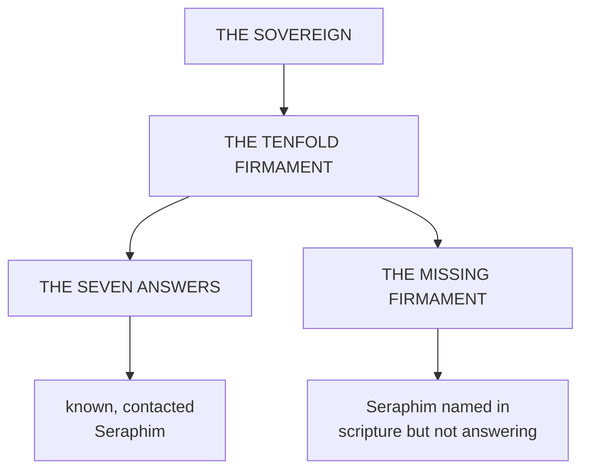

**Tier Classification:** Tier I-B - Applied Divination Ecology / Stellar Taxonomy Doctrine
**Authority:** Subordinate to Tier I cosmology and system codices. Cross-references: Divination, The Church, Lunar Crown, Shores.
**Scope:** The Firmament as Church inheritance, stellar vessel taxonomy, Magnitude doctrine, Oracles, and demonic derivative states.

---

## Definition

The **Firmament** is the Church's inherited celestial language for Sovereign-facing Presence and its ordered or corrupted expressions.

At Church level, this is angelology, demonology, vessel doctrine, liturgical astronomy, and post-Fracture caution before the sky. The Church speaks of the Sovereign, the Tenfold Firmament, the Seven Answers, the Missing Firmament, saints, angels, demons, Oracles, Divine Vessels, Diviners, and the peril of Presence borne beyond a vessel's Bearing.

At codex-truth level, the stellar ladder describes fragment and coherence nodes within Divination ecology. "Stars" in this taxonomy are not astronomical bodies. They are source-scale designations: centers, fragments, residues, and vessel-facing points of contact.

---

## Why Stellar Language Survived

Before the Fracture, Terra inherited a curated heaven. Ksy'rion made the sky legible without making the farther heaven directly dangerous. The old language of stars, lamps, constellations, and ordered heights survived the loss of that curated sky because it gave mortal institutions a way to speak about hierarchy without naming the full mechanism beneath it.

After the Fracture, the sky became both sign and wound. The Church's stellar language therefore carries reverence and fear at once. A star may be an answering angelic office, a corrupted abyssal point, a saintly sign, or a warning that a mortal vessel is carrying more Presence than their Bearing can hold.

---

## The Sovereign and the Tenfold Firmament

The Church's restricted doctrine places the **Sovereign** above the highest angelic order. Beneath Him stand the **Ten Seraphim**, collectively called the **Tenfold Firmament**.

Of these ten, seven maintain stable, repeated, survivable contact with the Church. They are the **Seven Answers**.

The remaining three are the **Missing Firmament**: preserved in scripture, absent from present regulated contact, and not publicly explained.

```diagram
THE SOVEREIGN
|
`-- THE TENFOLD FIRMAMENT
    |
    |-- THE SEVEN ANSWERS
    |   `-- Seraphim with stable Church contact
    |
    `-- THE MISSING FIRMAMENT
        `-- Seraphim named in scripture but not answering
```



The Church does not understand this as fragment ecology. It understands it as ordered heavenly attendance.

---

## Seraphic Constellations

A **Seraphic Constellation** is the ordered Divination ecology descending from one Seraphim.

```diagram
SERAPHIC CONSTELLATION
|
`-- CYNOSURE
    `-- the central Seraphic identity
        |
        |-- CARDINAL STARS
        |   `-- major descending fragments
        |
        `-- STELLATES
            `-- lesser angelic offices
                |
                `-- MOTES / SPARKS / GLEAMS
                    `-- minor contacts, residues, or brief lights
```

The **Cynosure** is the central star. **Cardinal Stars** are major descending fragments beneath it. **Stellates** are lesser offices or fragments. **Motes**, **Sparks**, and **Gleams** are smaller contact points, residues, or brief lights.

---

## Abyssal Constellations

An **Abyssal Constellation** is the corrupted or demonic counterpart to Seraphic ordering.

```diagram
ABYSSAL CONSTELLATION
|
`-- ABYSSARCH / BLACK NEXUS
    `-- central corrupted identity
        |
        |-- BLACK STARS
        |   `-- major descending fragments
        |
        `-- CINDERS
            `-- lesser demonic fragments
                |
                `-- ASHES / BLACK MOTES
                    `-- residual or minor contacts
```

Demons proper are demonic presences or infernal entities. Demonic creatures are mortal, postmortem, bodily, or residual structures altered by demonic Presence or saturation. Vampires, ghouls, ghosts, werewolves, Hollowed, Worn, and Consumed cases are derivative afterstates or haunt-states, not automatically demons proper.

Divination can drive stable reconfiguration into such states. It does not create new species ex nihilo.

---

## Magnitude

**Magnitude** is vessel/source scale. It is not rank.

- **Gleam** - minimal or passing Presence, often visionary or barely stable.
- **Spark** - small but repeatable Presence with limited Weight.
- **Mote** - minor fragment contact capable of stable effects under strain.
- **Stellate** - lesser angelic or demonic office capable of producing a stable vessel.
- **Cardinal** - major star contact carrying broader domain Weight.
- **Cynosure** - central-star contact with the governing identity of a constellation.

An Obsidian rank such as Votary or Rector-Ascendant is institutional command seniority. A Magnitude such as Stellate or Cynosure is source scale. They may correlate in extreme cases. They are never the same axis.

---

## Divine Vessels, Diviners, and Oracles

A **Divine Vessel** is a person carrying angelic Presence who has not necessarily been recognized, processed, trained, disciplined, or assigned by the Church. A Divine Vessel may be discovered anywhere and may be frightened, hidden, unstable, exploited, or misclassified.

A **Diviner** is a Church-recognized, trained, Obsidian-assigned Divine Vessel. All recognized Church Diviners serve in Obsidian. No other Church branch independently trains, deploys, classifies, or supervises Diviners.

Not everyone in Obsidian is a Diviner. Obsidian also contains non-vessel priests, confessors, Ecclesiastic Surgeons, Oracles, Menders, Keepers, expulsors, investigators, restricted theologians, administrators, field commanders, archivists, and support personnel.

An **Oracle** is an Obsidian sight-bearing role associated with the Gift of Sight. The Oracles of Obsidian should not be confused with **Oracle, the Skyphon of Foresight**.

---

## State

State describes how deeply Presence has altered the vessel.

| Structural Condition | Angelic Church Term | Demonic Church Term |
|---|---|---|
| Initial contact | Touched / Visited | Marked / Pressed |
| Partial fusion | Beatified | Worn |
| Deep fusion | Crowned | Hollowing |
| Saturation | Saint / Living Relic / severe Crowned | Hollowed / Consumed |
| Stable altered state | Crowned state | Hollowed state / Consumed state |

Beatified is lower than Crowned. Crowned is the deeper, stable, identity-reorienting condition. Saints, living relics, and severe Crowned outcomes sit near saturation.

---

## Church Knowledge and Codex Truth

The Church knows the Firmament as theology, restricted observation, liturgy, and operational doctrine. It does not know the full codex-truth cosmology beneath it. It does not know the Book-level war, Primordials, the external attacker truth, Archive mechanics, or the full structural equivalence between its angelic vessel doctrine and other Divination systems.

The irony is structural: Church angelology preserves useful stellar taxonomy, but explains it through obedience, Presence, angels, demons, saints, Bearing, and the Sovereign. Codex-truth describes fragment ecology, coherence nodes, Magnitudes, and fusion mechanics beneath those names.

---

## In One Sentence

The Firmament is the Church's inherited celestial grammar for ordered and corrupted Presence, while codex-truth reads the same stellar ladder as Divination ecology: Magnitudes, constellations, vessels, Oracles, and derivative states arranged by source scale rather than by astronomical sky.
