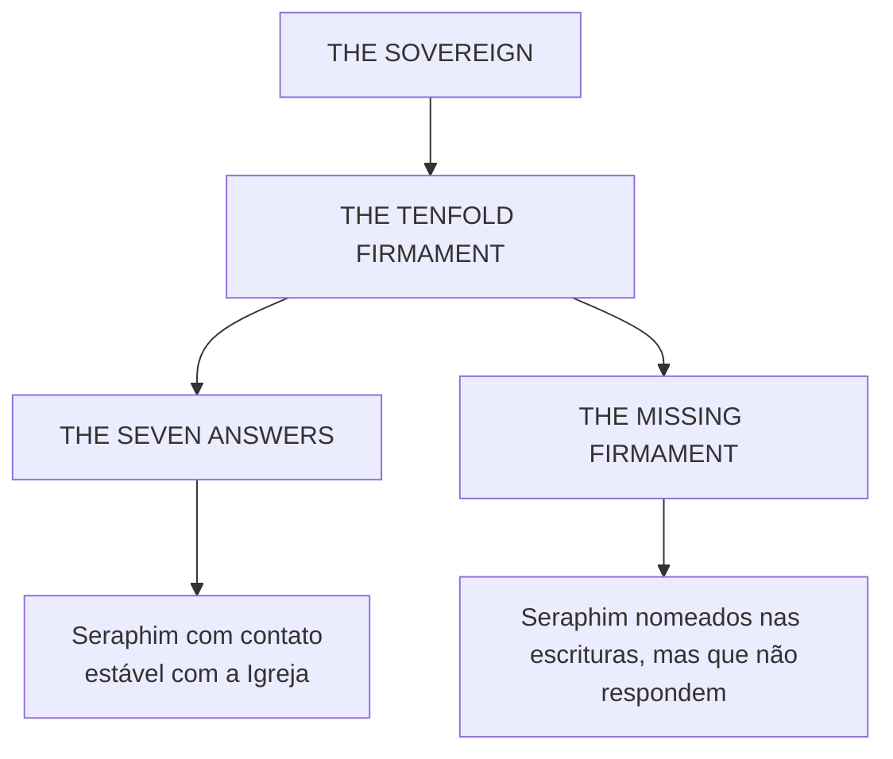
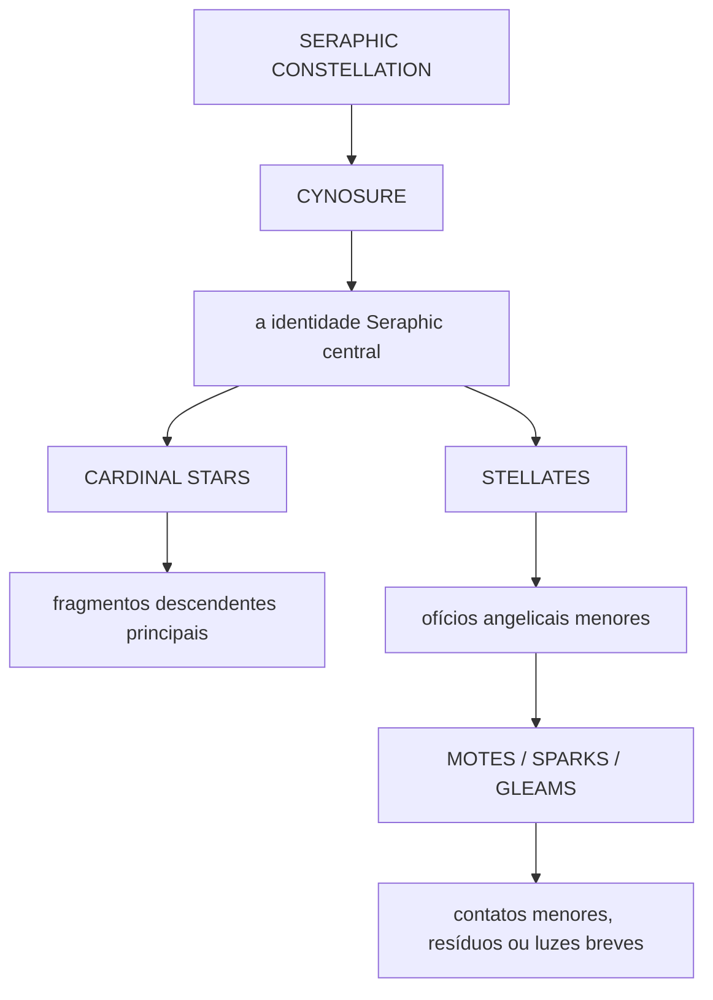
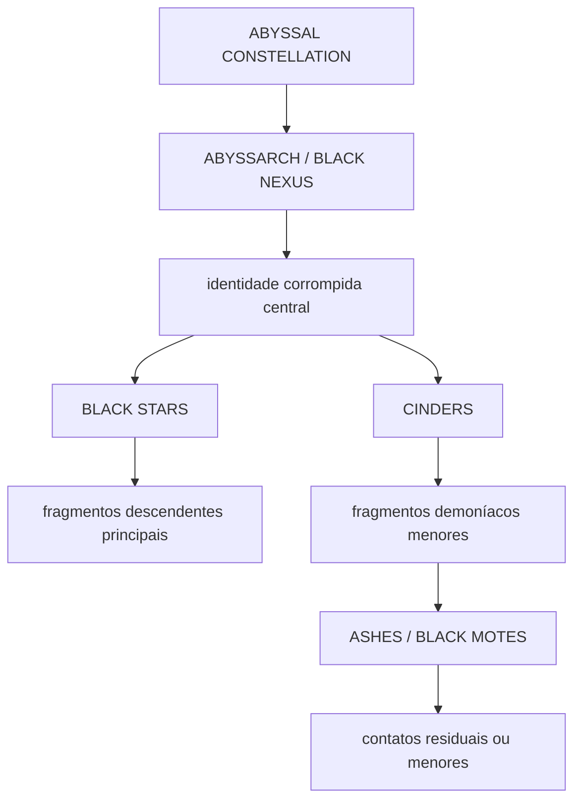

**Classificação de Tier:** Tier I-B - Ecologia Aplicada de Divination / Doutrina de Taxonomia Estelar
**Autoridade:** Subordinada à cosmologia Tier I e aos codices de sistemas. Referências cruzadas: Divination, a Igreja, Lunar Crown, Shores.
**Escopo:** The Firmament como herança da Igreja, taxonomia estelar de vessels, doutrina de Magnitude, Oracles e estados derivados demoníacos.

---

## Definição

**Firmament** é a linguagem celeste herdada da Igreja para Presence voltada ao Sovereign e suas expressões ordenadas ou corrompidas.

No nível da Igreja, isso é angelologia, demonologia, doutrina de vessel, astronomia litúrgica e cautela pós-Fracture diante do céu. A Igreja fala do Sovereign, do Tenfold Firmament, das Seven Answers, do Missing Firmament, de santos, angels, demons, Oracles, Divine Vessels, Diviners e do perigo da Presence carregada além do Bearing de um vessel.

No nível de verdade do codex, a escada estelar descreve nós de fragmento e coerência dentro da ecologia da Divination. "Estrelas" nessa taxonomia não são corpos astronômicos. São designações de escala de fonte: centros, fragmentos, resíduos e pontos de contato voltados a vessels.

---

## Por Que a Linguagem Estelar Sobreviveu

Antes da Fracture, Terra herdou um céu curado. Ksy'rion tornou o céu legível sem tornar o céu mais distante diretamente perigoso. A velha linguagem de estrelas, lâmpadas, constelações e alturas ordenadas sobreviveu à perda desse céu curado porque deu às instituições mortais uma forma de falar sobre hierarquia sem nomear o mecanismo completo sob ela.

Depois da Fracture, o céu tornou-se sinal e ferida ao mesmo tempo. A linguagem estelar da Igreja, portanto, carrega reverência e medo simultaneamente. Uma estrela pode ser um ofício angelical responsivo, um ponto abissal corrompido, um sinal santo ou um aviso de que um vessel mortal está carregando mais Presence do que seu Bearing consegue sustentar.

---

## The Sovereign e o Tenfold Firmament

A doutrina restrita da Igreja coloca o **Sovereign** acima da ordem angelical mais alta. Abaixo Dele ficam os **Ten Seraphim**, chamados coletivamente de **Tenfold Firmament**.

Desses dez, sete mantêm contato estável, repetido e sobrevivível com a Igreja. Eles são as **Seven Answers**.

Os três restantes são o **Missing Firmament**: preservados nas escrituras, ausentes do contato regulado atual e não explicados publicamente.

A Igreja não entende isso como ecologia de fragmentos. Ela entende como assistência celestial ordenada.

---

## Seraphic Constellations

Uma **Seraphic Constellation** é a ecologia ordenada de Divination que descende de um Seraphim.

O **Cynosure** é a estrela central. **Cardinal Stars** são fragmentos descendentes principais abaixo dele. **Stellates** são ofícios ou fragmentos menores. **Motes**, **Sparks** e **Gleams** são pontos de contato, resíduos ou luzes breves menores.

---

## Abyssal Constellations

Uma **Abyssal Constellation** é a contraparte corrompida ou demoníaca da ordenação Seraphic.

Demons propriamente ditos são presenças demoníacas ou entidades infernais. Criaturas demoníacas são estruturas mortais, pós-morte, corporais ou residuais alteradas por Presence demoníaca ou saturação. Vampiros, ghouls, ghosts, werewolves, casos Hollowed, Worn e Consumed são afterstates derivados ou haunt-states, não automaticamente demons propriamente ditos.

Divination pode conduzir reconfiguração estável para esses estados. Ela não cria novas espécies ex nihilo.

---

## Magnitude

**Magnitude** é escala de vessel/fonte. Não é rank.

- **Gleam** - Presence mínima ou passageira, muitas vezes visionária ou quase instável.
- **Spark** - Presence pequena, mas repetível, com Weight limitado.
- **Mote** - contato de fragmento menor capaz de efeitos estáveis sob tensão.
- **Stellate** - ofício angelical ou demoníaco menor capaz de produzir um vessel estável.
- **Cardinal** - contato de estrela principal carregando Weight de domínio mais amplo.
- **Cynosure** - contato de estrela central com a identidade governante de uma constelação.

Um rank de Obsidian como Votary ou Rector-Ascendant é senioridade de comando institucional. Uma Magnitude como Stellate ou Cynosure é escala de fonte. Eles podem se correlacionar em casos extremos. Nunca são o mesmo eixo.

---

## Divine Vessels, Diviners e Oracles

Um **Divine Vessel** é uma pessoa que carrega Presence angelical e que não necessariamente foi reconhecida, processada, treinada, disciplinada ou designada pela Igreja. Um Divine Vessel pode ser descoberto em qualquer lugar e pode estar assustado, escondido, instável, explorado ou mal classificado.

Um **Diviner** é um Divine Vessel reconhecido pela Igreja, treinado e designado para Obsidian. Todos os Diviners reconhecidos pela Igreja servem em Obsidian. Nenhum outro ramo da Igreja treina, mobiliza, classifica ou supervisiona Diviners de forma independente.

Nem todos em Obsidian são Diviners. Obsidian também contém padres não-vessel, confessores, Ecclesiastic Surgeons, Oracles, Menders, Keepers, expulsors, investigadores, teólogos restritos, administradores, comandantes de campo, arquivistas e pessoal de suporte.

Um **Oracle** é uma função sight-bearing de Obsidian associada ao Gift of Sight. Os Oracles de Obsidian não devem ser confundidos com **Oracle, the Skyphon of Foresight**.

---

## Estado

Estado descreve quão profundamente a Presence alterou o vessel.

| Condição Estrutural | Termo angelical da Igreja | Termo demoníaco da Igreja |
|---|---|---|
| Contato inicial | Touched / Visited | Marked / Pressed |
| Fusão parcial | Beatified | Worn |
| Fusão profunda | Crowned | Hollowing |
| Saturação | Saint / Living Relic / severe Crowned | Hollowed / Consumed |
| Estado alterado estável | Crowned state | Hollowed state / Consumed state |

Beatified é inferior a Crowned. Crowned é a condição mais profunda, estável e reorientadora de identidade. Santos, living relics e desfechos Crowned severos ficam perto da saturação.

---

## Conhecimento da Igreja e Verdade do Codex

A Igreja conhece o Firmament como teologia, observação restrita, liturgia e doutrina operacional. Ela não conhece a cosmologia completa de verdade do codex sob ele. Ela não conhece a guerra em nível de Book, os Primordials, a verdade do atacante externo, as mecânicas do Archive ou a equivalência estrutural completa entre sua doutrina de vessels angelicais e outros sistemas de Divination.

A ironia é estrutural: a angelologia da Igreja preserva taxonomia estelar útil, mas a explica através de obediência, Presence, angels, demons, santos, Bearing e o Sovereign. A verdade do codex descreve ecologia de fragmentos, nós de coerência, Magnitudes e mecânicas de fusão sob esses nomes.

---

## Em Uma Frase

The Firmament é a gramática celeste herdada da Igreja para Presence ordenada e corrompida, enquanto a verdade do codex lê a mesma escada estelar como ecologia de Divination: Magnitudes, constelações, vessels, Oracles e estados derivados organizados por escala de fonte, não pelo céu astronômico.
